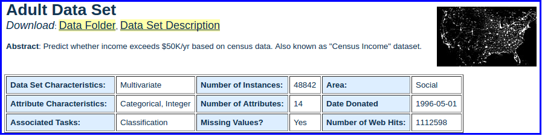
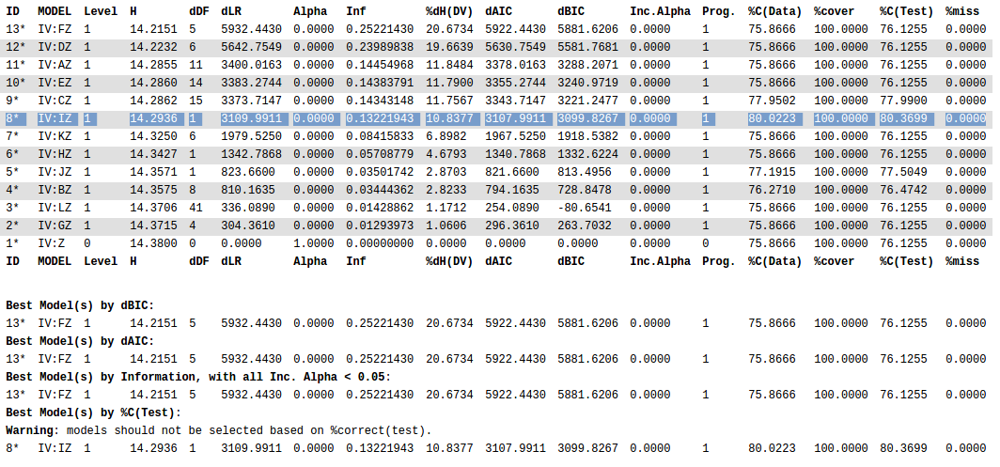
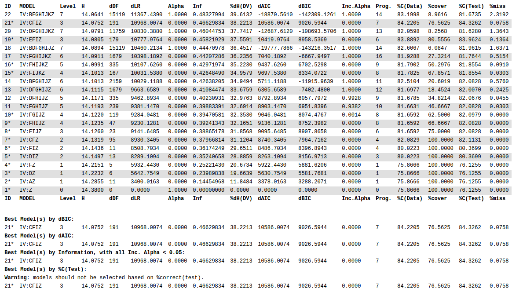
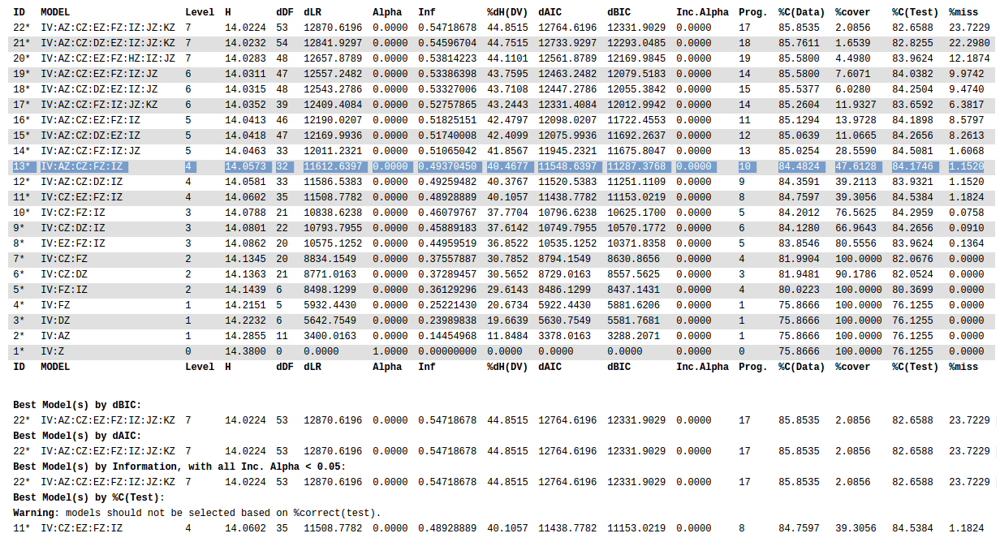
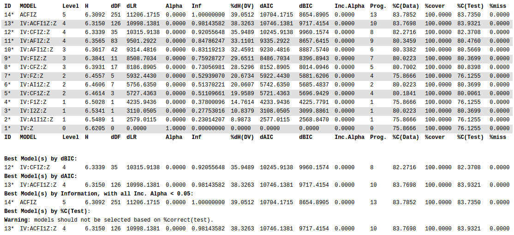

```{r setup, include=FALSE}
knitr::opts_chunk$set(echo = TRUE)

library(OneR)
```

## Introduction

The goal of this vignette is to demonstrate taking a data set and preparing it for use with OCCAM using R.  It demonstrates loading data, then using a variety of tools in R for working with categorical data (such as adjusting the levels, and binning continuous variables) then uses a function that will render an OCCAM data input file from a dataframe of factors (categorical variables).

### Datasets

We'll be selecting a data set from the [UCIML Repository](https://archive.ics.uci.edu/ml/datasets.html).  Specifically we'll be using the [Adult](http://archive.ics.uci.edu/ml/datasets/Adult) dataset (http://archive.ics.uci.edu/ml/datasets/Adult).  It's a collection of some census data that's been used in many publications to show the capability of various algorithms to be able to predict if the income of a case will be above $50,000.  It's appealing for this project because it has several categorical variables and a few continuous ones.

  


## Preparing the Data

The first step, of course, is loading the data into R so we can analyze it.  The data from UCIML usually comes without headings/variable-names and has a separate file containing those.  The following loads the data into a data frame called `ad` and names the columns appropriately.  

```{r}
# read the main datafile, keeping default of strings as factors, remove any whitespace around strings
ad <- read.csv("./data/adult.data.txt", header=FALSE, strip.white = TRUE)

# read in the file with column names
an <- read.csv("./data/adult.names.txt", header=FALSE, sep=";", stringsAsFactors=FALSE)

# hard-coding that we are only interested in the rows 97-107 (the rest is just explanation)
col_names <- sapply(strsplit(as.vector(an[94:107,]),":"), "[", 1)

# remove hyphens from column names
col_names <- gsub("-", "", col_names)

col_names <- c(col_names, "income")

colnames(ad) <- col_names
```

Note that this bit of code is somewhat hard-coded for this data set and is not generally applicable.  

And now that the data is loaded, let's take a couple looks at it, just to see what's in there.  One of the things I really like about R is that it makes it pretty simple to inspect a dataset.  The first thing I usually like to use is the `str` (structure) command.  It gives some great details about a variable, or particularly a data frame, including data types and typical values.

```{r, comment=NA}
str(ad)
```

At this point it might also be helpful to look at the variable descriptions from the `names` file:
```{r, comment=NA}
cat(an[94:107,], sep ="\n")
```

Along with the structure of the data, it's helpful to get a `summary` of the data values within the data.  

```{r, comment=NA}
summary(ad)
```


### Fixing "Education"

"Education" appears in two different variables, one continuous, and one categorical (factor).  I'm not sure we need both, so let's take a look at the values they take together.  

```{r, comment=NA}
ed <- unique(ad[c("educationnum","education")])

ed[order(ed$educationnum),]

```

As we can see from that, it appears `educationnum` is merely a coding of `education`.  Since R already encodes `education` as a factor, we can probably remove it.  But before do that, we'll want to see how `education` has been encoded as a factor.  One advantage we get from `educationnum` is that the amount of education is ordered, which may make it easier to re-bin into fewer bins/factors later in our analysis.  For example, we could combine the values of `educationum` from 1-12 as a single factor, "k-12".  The default factorization of `education` as it was read from the data file may end up with a less sensible order.

We can investigate how `education` was set up as a factor this way.  `str` tell us the following:

```{r, comment=NA}
str(ad$education)
```

Which makes it look like the order isn't sensible, but is probably alphabetical, which may not be as helpful.  We can confirm using `levels`, and then asking for the levels 1-5. 
```{r, comment=NA}
levels(ad$education)
levels(ad$education)[1:5]
```

Having confirmed that the factor coding for `education` makes less sense than `educationnum`, what we'd like to do is re-factor `education` with the order provided by `educationnum`, then delete `educationnum`.  Before we do that, let's take a look at the breakdown of `education` to make sure we end up with a correct re-coding.

```{r, comment=NA}
summary(ad$education)
```

Let's use `ed` from above to set up the new factorization or `levels` for `education`.  Then use that to re-factor the `education` variable.

```{r, comment=NA}
ed <- ed[order(ed$educationnum),]
levels(factor(ed$educationnum, levels=ed$education))

ad$education <- factor(ad$education, levels = as.vector(ed$education))

summary(ad$education)
```

And with that summary, we can see that we've recoded `education` to have the correct order, and a quick comparison of the summary numbers shows that the values match after that transformation.

We can now remove `educationnum` from the dataset.  We can also get rid of the `ed` data frame since we won't use it any more.

```{r, comment=NA}
ad <- ad[, !(colnames(ad) %in% c("educationnum"))]
rm(ed)

str(ad)
```

### Removing `fnlwgt`

`fnlwgt` is some kind of weighting in the dataset that has some detailed explanation about it, but I still can't quite make sense of how to use it.  So for purposes of this analysis, I'm removing the variable.

```{r, comment=NA}
ad <- ad[, !(colnames(ad) %in% c("fnlwgt"))]

```

### Now for the Binning

In this section we'll deal with the variables and try to feature different ways variables can be binned in R using various libraries.

Most of the variables are already categorical because they are factors.  Let's take a look at the variables that are not factors and decide how to handle them.


```{r, comment=NA}
str(ad[,!sapply(ad, is.factor)])
summary(ad[,!sapply(ad, is.factor)])

```

#### Age

The `summary` data above help see what values `age` takes.  But it might be even more helpful to see more detail.  It's an integer from 17 to 90, but it might be helpful to see the distribution.

One way is to use the `table` command.  Another is to do an actual histogram as a chart.

```{r, comment=NA}
table(ad$age)

hist(x = ad$age)
```

Age, of course, is one of those variables that's often binned in a specific way.  For the Census, this is often broken down in a hierarchy.  The top level is "Under 65 Years" and "64 and Over".  

Under that are:  15-24, 25-34, 35-44, 45-54, 55-64, 65-74, 75+

And lowest is:  15-24, 25-29, 30-34, 35-39, 40-44, 45-49, 50-54, 55-59, 60-64, 65-69, 70-74, 75+

Let's start by using the lowest level of age hierarchy, since it's easy to regroup them later into fewer bins.

```{r, comment=NA}
age_breaks <- seq(from = 25, to = 75, by = 5)   # all but first break are 5 years apart

age_breaks <- c(15, age_breaks)                 # insert the first value at the beginning

age_breaks <- c(age_breaks, max(ad$age))        # make sure the highest value is contained in the breaks

# confirm that our age-breaks look like what we've described above
age_breaks

# and now plot a histogram using these bins
hist(x = ad$age, breaks = age_breaks)

```

`cut` can be used with the same breaks as `hist` to bin data.  `hist` can be called with a `plot = FALSE` option to then get the counts or density.  A summary of `cut` with the same breaks reveals the same counts as shown in the histogram.

```{r, comment=NA}

hist(x = ad$age, breaks = age_breaks, plot = FALSE)$counts

summary(cut(x=ad$age, breaks = age_breaks))
```

And now we're ready to replace the `age` variable with its discretized (factor) version.  Note that this permanently changes the variable.

```{r, comment=NA}
ad$age <- cut(x=ad$age, breaks = age_breaks)
str(ad$age)
summary(ad$age)
```

Before moving on, let's look at how we would aggregate/group the levels of the age factor we just created.  One easy way is to simply assign new `levels` to the variable, duplicating the new level in the position of the lower levels it encompasses.  In this case, it should go from 12 levels to 7.

```{r, comment=NA}
# Old: 15-24, 25-29, 30-34, 35-39, 40-44, 45-49, 50-54, 55-59, 60-64, 65-69, 70-74, 75+
# New: 15-24, 25-34,        35-44,        45-54,        55-64,        65-74,        75+

# make a new vector with the new factor labels.  In the data above the non-end factors are grouped by 2s
# so the new vector states the new factor twice for each of those
new_age_breaks <- c("15-24", 
                    "25-34", "25-34",   # encompases 25-29 and 30-34
                    "35-44", "35-44", 
                    "45-54", "45-54", 
                    "55-64", "55-64", 
                    "65-74", "65-74", 
                    "75+")

# make a copy of the age variable because we don't want to make this change to our data (just yet)
age_tmp <- ad$age

levels(age_tmp) <- new_age_breaks

str(age_tmp)
summary(age_tmp)
```

A similar procedure would be followed to apply the highest level of hierarchy with just 2 levels.

Note that OCCAM offers the ability to re-bin a variable by combining existing levels (states).  Also note the the above re-binning only works if new levels are a strict combination of the old levels.  If you want new break-points (e.g. age 15-32), it's necessary to apply the new bins to the original numeric data.


#### Capital-Gain

`capitalgain` is a variable that will be more challenging/interesting than `age`.  It is not evenly distributed and has a lot of sparseness.  This will offer an opportunity to explore other binning options in R.


```{r, comment=NA}
summary(ad$capitalgain)
table(ad$capitalgain)
hist(ad$capitalgain)

```

As we can see, a vast majority of cases have 0 capital gains, so maybe it was interesting to exclude that value and see what's in there. 
```{r, comment=NA}

summary(ad$capitalgain[ad$capitalgain>0])
hist(ad$capitalgain[ad$capitalgain>0])
```

Considering capital-gains are something most people don't have, maybe the obvious binning is binary one, "doesn't have", "has capital gains". For this we don't need to use `cut`.  In this case, we'll use `levels` with a logical function applied to the values in the column.

```{r, comment=NA}
summary(as.factor((ad$capitalgain > 0)))
```

Now, it might be interesting to see what a contingency table of `capitalgain` and `income` looks like.  

```{r, comment=NA}
tmp <- data.frame(capitalgain = as.factor((ad$capitalgain > 0)))
tmp$income <- ad$income
table(tmp)

```
It looks like *not* having capital gains could possibly be a good predictor of income, but having capital gains doesn't seem to be very discriminatory.  This is something we can explore in a state-based model search.

That said, there are other binning strategies we can pursue with this variable.  For these, we'll use functions from the `OneR` package.  `OneR` is primarily a library that create 1-level decision trees with each variable to see which "One" variable model is the best predictor.  

It offers a function called `bin`, which can use various methods for binning, such as equal-width binning, equal-content binning, and cluster binning.

In DMIT we've discussed binning by 12 because it can easily be re-grouped into 6, 4, 3, or 2 bins.
```{r, comment=NA}
table(bin(data = ad$capitalgain, method = "length", nbins = 12))
```

In this case, 12 equal-width bins (`length`), we get quite a few 0's, which can cause problems with the results in OCCAM.

Another approach is to make 12 bins based on `content`, trying to make each bin as equal in size as possible (this will have problems due to the huge relative number of 0s). 

```{r, comment=NA}
table(bin(data = ad$capitalgain, method = "content", nbins = 12))
```

The algorithm can't easily deal with the 0 problem, so let's look at binning everything except the 0s.

```{r, comment=NA}
# 0 is interesting and large
table(bin(data = ad$capitalgain[ad$capitalgain > 0], method = "content", nbins = 11))
plot(bin(data = ad$capitalgain[ad$capitalgain > 0], method = "content", nbins = 11))
```

Another approach is to use the `cluster` method.  Given a number of bins it will try to find the best clustering by that number.  One caveat is that it will generate an error if the cluster size is 0.  One can try to get around this by providing initial cluster positions.
```{r, comment=NA}
table(bin(data = ad$capitalgain, method = "cluster", nbins = 3))
plot(bin(data = ad$capitalgain, method = "cluster", nbins = 3))
```

One last option offered by `OneR` is to use targeted binning.  This may be questionable because it might be biasing the results or adding hidden additional degrees of freedom (Harrell).

To do this, I create a temporary data frame with just the variables involved.  Optbin then operates on that data frame and based on the method chosen, will bin the data optimally.

```{r, comment=NA}
tmp <- data.frame(capitalgain = ad$capitalgain)
tmp <- cbind(tmp, ad$income)

summary(optbin(tmp, method = "logreg"))

summary(optbin(tmp, method = "infogain"))

```

The difference between these two methods is that `logreg` puts the split at around $4,010, and `infogain` puts it at $7,070.  

Because this variable is so skewed with 0, I'll just choose to use the `infogain` method to come up with a low/high value.

```{r, comment=NA}
tmp <- data.frame(capitalgain = ad$capitalgain)
tmp <- cbind(tmp, ad$income)

ad$capitalgain <- optbin(tmp, method = "infogain")$capitalgain
levels(ad$capitalgain) <- c("low", "high")

summary(ad$capitalgain)
```

#### Capital-Loss
Let's look at `capitalloss`.

```{r, comment=NA}
hist(ad$capitalloss)
```

It looks a lot like `capitalgain`, so for expedience, we can apply the targeted `optbin` method.

```{r, comment=NA}
tmp <- data.frame(capitalloss = ad$capitalloss)
tmp <- cbind(tmp, ad$income)

ad$capitalloss <- optbin(tmp, method = "infogain")$capitalloss
levels(ad$capitalloss) <- c("low", "high")

summary(ad$capitalloss)
```


#### Hours-per-Week

With Hours-per-Week, there is probably a good basis for 3-bins like: "half-time", "full-time", "over-time".  But in this case, I'd like to bin with the DMIT-recommended 12 bins, using a content-based method.

```{r, comment=NA}

table(bin(data = ad$hoursperweek, method = "content", nbins = 12))
plot(table(bin(data = ad$hoursperweek, method = "content", nbins = 12)))

```

In this case, the `quantile` method used only allowed for 7 bins, but the results look reasonable and we can always group some of the bins if necessary.

```{r, comment=NA}

ad$hoursperweek <- bin(data = ad$hoursperweek, method = "content", nbins = 12)

```

#### The Data Looks Ready!

We've now discretized all the variables in our data frame.

```{r, comment=NA}
str(ad)
```

## Good Machine Learning Practice - Designating Test Data

In machine learning, it's important to set aside some data for testing your models on.  Your training and parameter tuning should never see this data.  It becomes the final, and hopefully unbiased, yard-stick by which to measure your models.

There is plenty of debate about how much data should be set aside.  In this case, I'll randomly choose 20% of the data to be set aside as *test* data.  I'll set up a vector with a `TRUE` or `FALSE` for each row in the dataset.  This will be used by our function for taking a data frame and making it into an OCCAM file.

(Side note:  UCIML already offers separate training and test files for this data set.  It might have been more appropriate to load both files and explicitly mark the test data as such.)

```{r, comment=NA}
set.seed(3141593)    # setting the random seed to ensure the same results every time we generate this document

test_prob <- 0.2
test_rows <- sample(x = c(TRUE, FALSE), size = nrow(ad), replace = TRUE, prob = c(test_prob, 1 - test_prob))

# now investigate:
head(test_rows)
summary(test_rows)

# to check the percentage 
paste("% Test Rows: ", 100 * as.numeric(summary(test_rows)[["TRUE"]]) / nrow(ad))
```

## Generating an OCCAM Data Set

I've created a function, `make_OCCAM_data` that will create an OCCAM compliant data file from our data frame.  

```{r, code=readLines("make_OCCAM_data.R"), echo = FALSE, results = 'hide'}
```


```{r, set-options, comment=NA}
occam_data <- make_OCCAM_data(ad, DV=13, test_rows = test_rows)

# the first 30 rows of the OCCAM data
options(width = 10)
head(occam_data, n = 30)

```

And now write the data to a file.
```{r, comment=NA}
filename <- "adult01.txt"
fileConn <- file(filename)
writeLines(occam_data, fileConn)
close(fileConn)

```

## Now to ANALYZE THE DATA!!!

Before we get going with OCCAM, it might be interesting to use `OneR` to find which single variable is the most predictive.

### OneR
Running `OneR` will let us know which variable is most predictive and how the values predict the dependent variable.  With the `verbose` output, this should be the equivalent of done a 1-level, bottom-up search in OCCAM, with single-variable models.  We're using the same training/test split for `OneR` as we are for OCCAM.

```{r, comment=NA}
options(width = 80)
training <- ad[test_rows==FALSE, ]
test     <- ad[test_rows==TRUE, ]

model <- OneR(training, verbose = TRUE)

summary(model)

plot(model)

prediction <- predict(model, test)

eval_model(prediction, test)
```

According to `OneR`, `capitalgain` is the best single variable for predicting `income`.

### OCCAM Variable-Based Model - Single Variable

To compare with `OneR`, I decided to start with running a single-variable/1-level search in OCCAM.



We can see that OCCAM and `OneR` agree that `I`, or `capitalgains` are the best predictor when looking at accuracy on the training data.

### OCCAM Variable-Based Model w/o Loops

Running OCCAM with the defaults (directed and loopless), the results are below.



The best model, by all criteria, is `IV:CFIZ`, where C is education, F is relationship, and I is capitalgain.

Relationship looks like a strange variable, and it's not clear what it represents.  Comparing it to `sex` yields:

```{r, comment=NA}
table(ad[,c(6,8)])
```

The best I can tell from reading the US Census site is that on a Census form, all the people in a house-hold are listed in a single report.  Then relationship tells how the additional people are related to the primary person filling the form.  I'm just puzzled about why that would be relevant.

I have to admit I was pleased to see `capitalgain` made the list!


### A model *with* loops
Now allowing for loops (which took about 3 minutes to run):



Here, the best model by dBIC is `IV:AZ:CZ:EZ:FZ:IZ:JZ:KZ`, giving us: age, education, occupation, relationship, capitalgain, capitalloss, and hoursperweek.  However this is over half the variables available!  

I lean towards choosing `IV:AZ:CZ:FZ:IZ`.  It uses fewer variables (age, education, relationship, and capitalgain), losing only `r 100 *(12331.9029 - 11287.3768)/12331.9029` % of dBIC, and only `r 85.8535 - 84.4824` points of accuracy (against the data), while improving dDF by `r 53 - 32` degrees.

#### A State-Based Model Search

To do a state-based search, we'll need to tell OCCAM to ignore some variables, otherwise it won't run (the state-space is too large!).  Here I set up the columns to ignore then see what we're keeping.  Starting with the model from above: `IV:AZ:CZ:FZ:IZ`, we'll modify and generate a new OCCAM file by setting "ignore" on the unwanted variables.

```{r, comment=NA}
keep <- c(1, 3, 6, 9, 13)
ignore <- setdiff(1:13, keep)

str(ad[ , keep])
```

##### Adjusting Cardinality of Age
We should also consider reducing the cardinality of some of the larger variables such as `age` and `education`.  We covered `age` earlier and can simply group the existing lower level hierarchy to the next level up.

```{r, comment=NA}
# Old: 15-24, 25-29, 30-34, 35-39, 40-44, 45-49, 50-54, 55-59, 60-64, 65-69, 70-74, 75+
# New: 15-24, 25-34,        35-44,        45-54,        55-64,        65-74,        75+

# make a new vector with the new factor labels.  In the data above the non-end factors are grouped by 2s
# so the new vector states the new factor twice for each of those
new_age_breaks <- c("15-24", 
                    "25-34", "25-34",   # encompases 25-29 and 30-34
                    "35-44", "35-44", 
                    "45-54", "45-54", 
                    "55-64", "55-64", 
                    "65-74", "65-74", 
                    "75+")

# make a copy of the age variable because we don't want to make this change to our data (just yet)

levels(ad$age) <- new_age_breaks

str(ad$age)
```

##### Adjusting Cardinality of Education

There is probably an obvious place to break `education`, since years of education and income are probably well-correlated.  We can investigate how to group the levels using `OneR`.

```{r, comment=NA}
OneR(ad[,c(1, 3, 6, 13)], verbose = TRUE)
```

Those results that show that the states Masters, Prof-school, and Doctorate predict income > 50k.  But maybe it would be useful to use 3 levels, "high school or less", "some college", "graduate college".


```{r, comment=NA}
# "Preschool", "1st-4th", "5th-6th","7th-8th", "9th", "10th", "11th", "12th", "HS-grad", "Some-college", "Assoc-voc", "Assoc-acdm", "Bachelors", "Masters", "Prof-school", "Doctorate" 
# New: 15-24, 25-34,        35-44,        45-54,        55-64,        65-74,        75+

# make a new vector with the new factor labels.  In the data above the non-end factors are grouped by 2s
# so the new vector states the new factor twice for each of those
new_ed_breaks <- c("K12", "K12", "K12", "K12", "K12", "K12", "K12", "K12", "<=HS", 
                    "<=Bachelors", "<=Bachelors", "<=Bachelors", "<=Bachelors",  
                    "Graduate", "Graduate", "Graduate") 

# make a copy of the age variable because we don't want to make this change to our data (just yet)

levels(ad$education) <- new_ed_breaks

str(ad$education)
```


And now modify our OCCAM file.
```{r, comment=NA}
occam_data <- make_OCCAM_data(ad, DV=13, test_rows = test_rows, ignore_cols = ignore)


filename <- "adult04.txt"
fileConn <- file(filename)
writeLines(occam_data, fileConn)
close(fileConn)

```

To get SB-Search to even run, it was necessary to reduce the cardinality as above.  That yielded the below.



It appears that the cardinality reduction weakened the models so that the variable-based models with loops give the best result.


***
***


## Appendix:  Useful Links while Writing This Vignette

Here are some sites that help solve various problems used in generating this document.

* Embedding another `.R` file in this document without copying it in directly:
[Making use of external R code in knitr and R markdown](http://zevross.com/blog/2014/07/09/making-use-of-external-r-code-in-knitr-and-r-markdown/)
* Outputing the character vector one per line (non-interleaved) to make OCCAM file look correct in this document: [Print an R vector vertically](https://stackoverflow.com/questions/25223977/print-an-r-vector-vertically)
* Making R output not have beginning hashes:  [Remove Hashes in R Output from RMarkdown and Knitr](https://stackoverflow.com/questions/15081212/remove-hashes-in-r-output-from-rmarkdown-and-knitr)
* Getting unique pairs of values from two variables: [unique() for more than one variable](https://stackoverflow.com/questions/7790732/unique-for-more-than-one-variable)
* Changing single column names in a data frame: [Changing column names of a data frame](https://stackoverflow.com/questions/6081439/changing-column-names-of-a-data-frame)
* Changing the ordering of factors: [Changing the order of levels of a factor](http://www.cookbook-r.com/Manipulating_data/Changing_the_order_of_levels_of_a_factor/)
* Dropping a data frame column by name: [Drop data frame columns by name](https://stackoverflow.com/questions/4605206/drop-data-frame-columns-by-name)
* Removing white-space while importing csv: [R fread and strip white](https://stackoverflow.com/questions/22757353/r-fread-and-strip-white)
* Extracting values from output functions like `summary`: [How do I extract just the number from a named number (without the name)?](https://stackoverflow.com/questions/15736719/how-do-i-extract-just-the-number-from-a-named-number-without-the-name)
* Grouping factors - as in the hierarchies of age: [Grouping 2 levels of a factor in R](https://stackoverflow.com/questions/9604001/grouping-2-levels-of-a-factor-in-r)
* Using `optbin` from `OneR`: [optbin](https://www.rdocumentation.org/packages/OneR/versions/2.2/topics/optbin)


## References

Kohavi R., Becker B., "Adult", http://archive.ics.uci.edu/ml/datasets/Adult,  UCI Machine Learning Repository http://archive.ics.uci.edu/ml. (1996), Irvine, CA: University of California, School of Information and Computer Science. (2017)

Harrell, Frank, "Problems Caused by Categorizing Continuous Variables",  http://biostat.mc.vanderbilt.edu/wiki/Main/CatContinuous, (2017)